Sauron
======
Sauron is a tool for prototyping functional objects, like video game
controllers, DJ mixers, or ergonomic mice. It works on computer vision, so
you don't have to spend time wiring up each button or joystick that you want
in your final prototype: a single camera can see them all.

The way it works is this: first, you create a 3D model of your object in
Solidworks, and put in special tagged geometry so Sauron knows what to look
for:
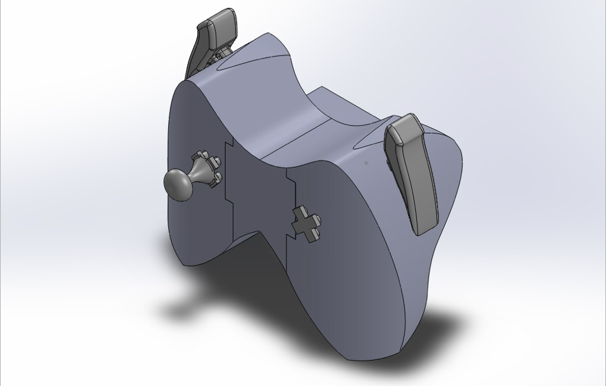
Then, you add in a 3D model which represents the camera you plan to use for
sensing. It's field of vision also needs to be modeled and tagged:
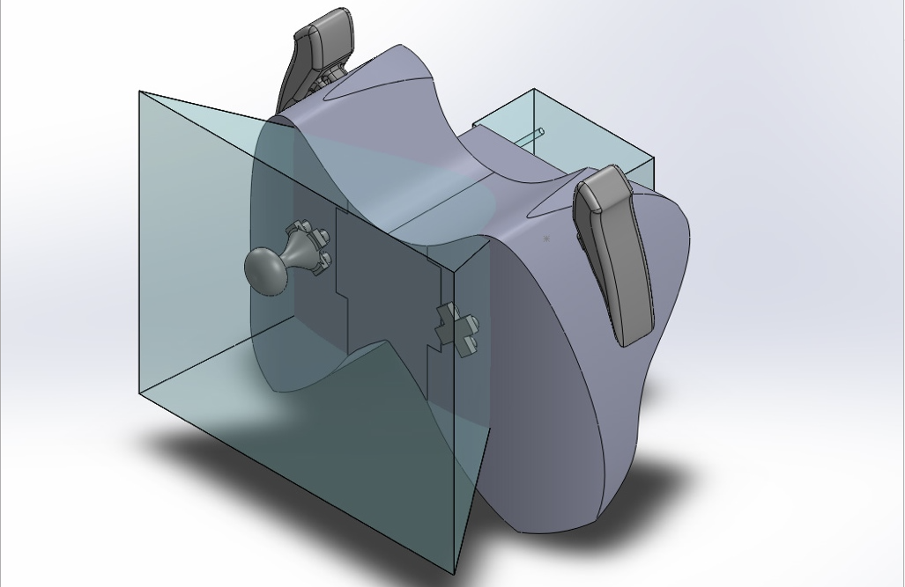
As you start working through the user interface, Sauron will do some analysis
on the locations of the parts in your object:
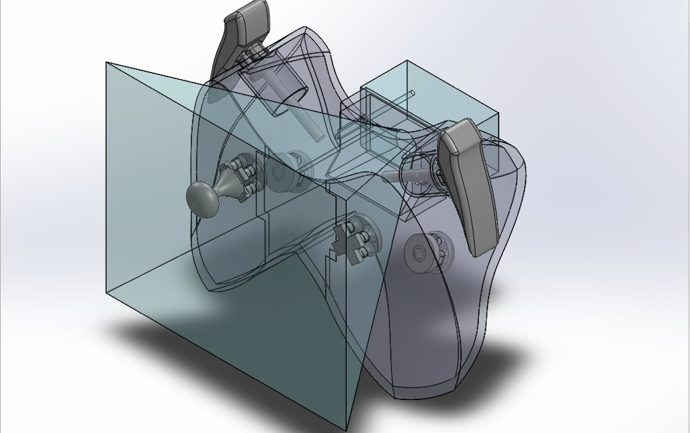
First, we decide if there's anything that already falls in the camera's
field of view (FOV). In this case, the joystick and D-Pad on the front
of the controller are already visible.
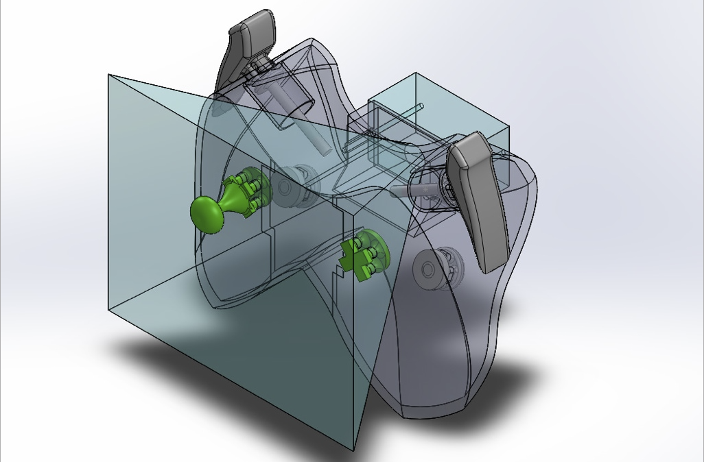
So we ignore those.
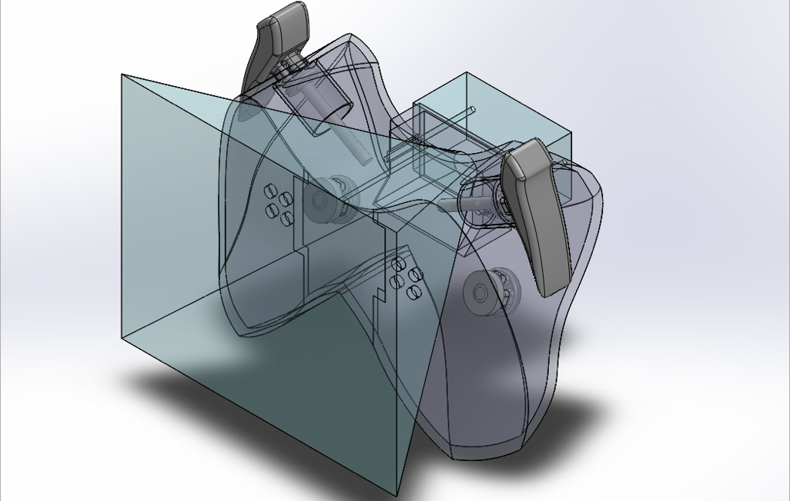
Sauron can also extrude pieces to go into the camera's field of view. The
bumper buttons on the side of the controller were processed in this way:
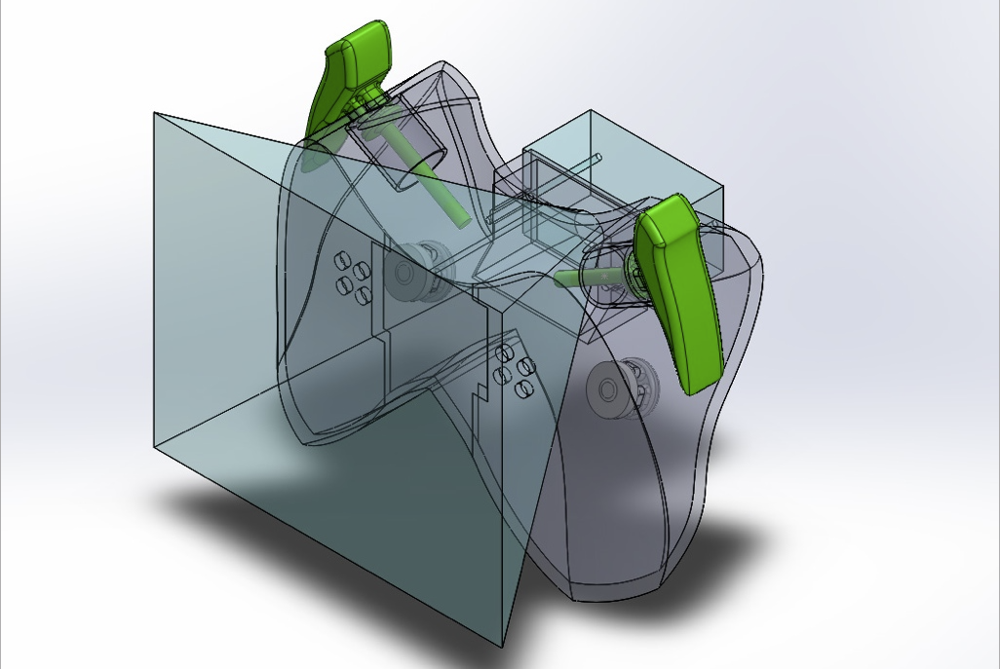
Originally they were stumpy little tagged geometry pieces,
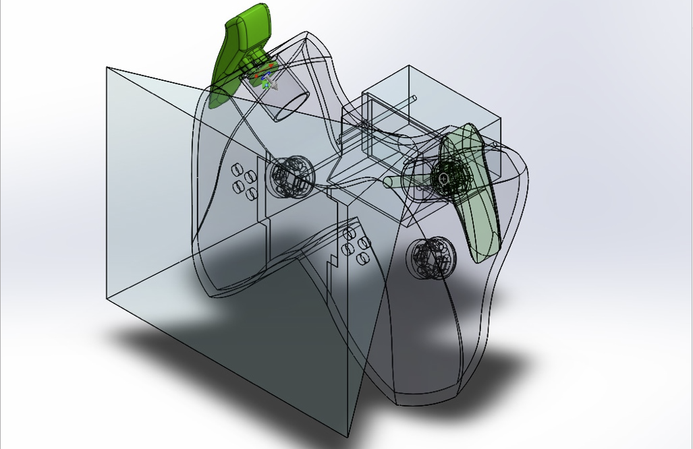
But we just stretch them until they reach the FOV cone.
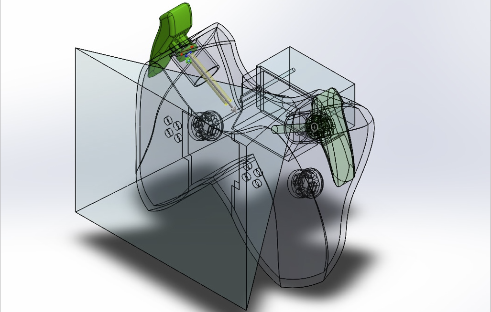
So, those are done once we extend them.
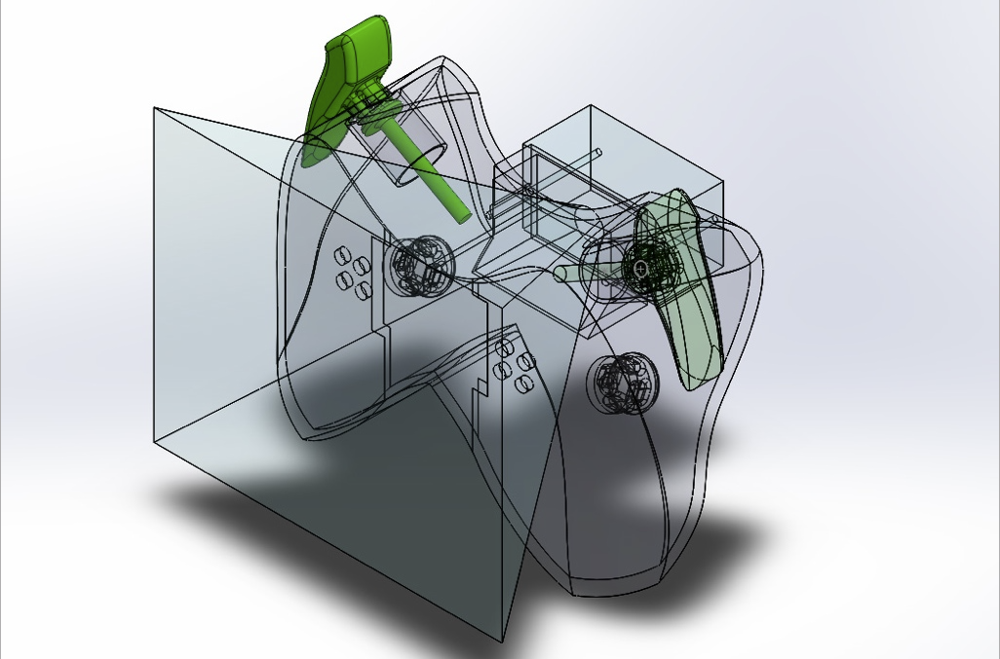
So we'll ignore them for now.
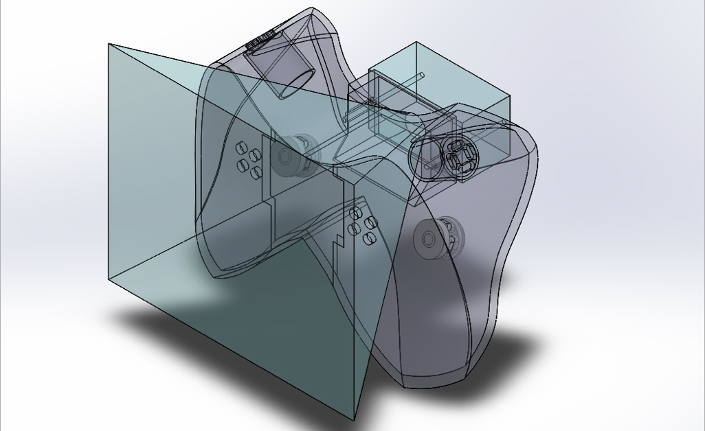
These buttons in the back are a different problem. We could extend them until
they hit the FOV cone, but unfortunately they'll hit the controller body if we
do that. Sauron does simulation to check, and finds that that's true.
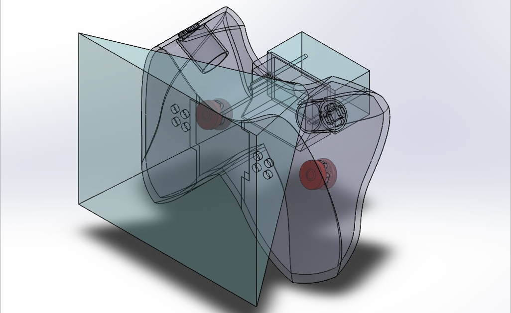
So we'll have to go for plan B. Sauron's plan B is mirrors. We can figure out
where the mirrors need to go by doing raycasting: the camera sends out a bunch
of rays, looks at where they go after they bounce off the inside surface of the
controller, and checks to see if any of them actually hit the buttons we're
looking for. All the ones that do are shown here. Sauron will put stars to
indicate where a mirror should go after printing (the camera will be able
to see the reflection of the buttons in the mirror):
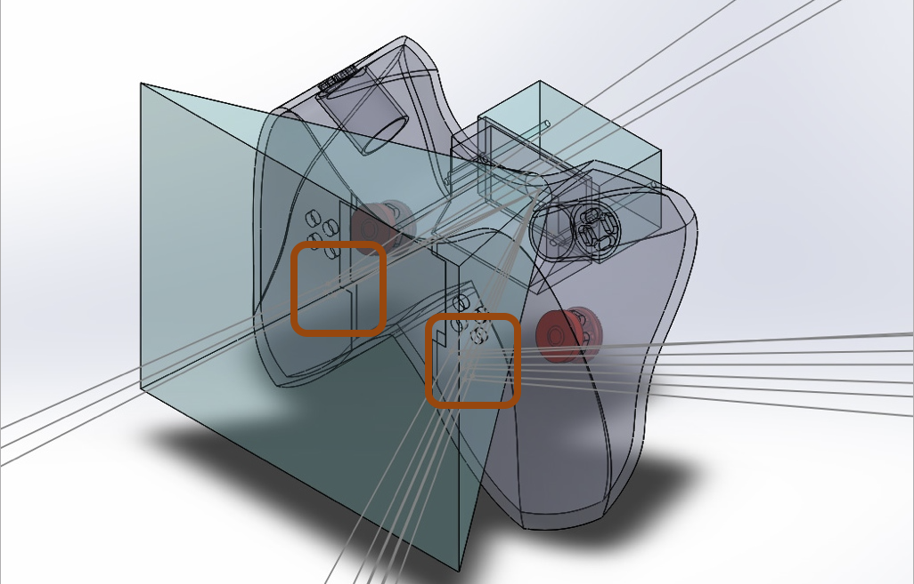
So, all put together, our processed controller looks like this:
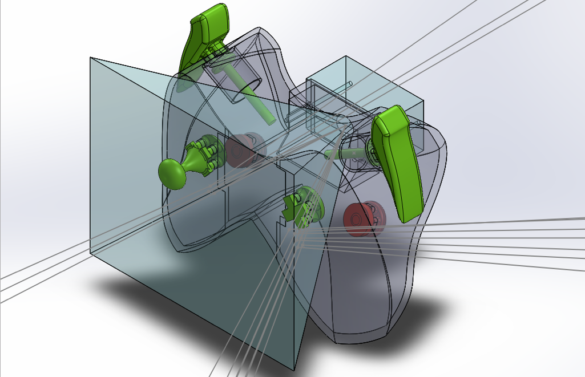
And when we print it out, we attach the camera that we modeled, color the
buttons, add the mirrors, and show it to the computer vision algorithms.
Then we're set to go!
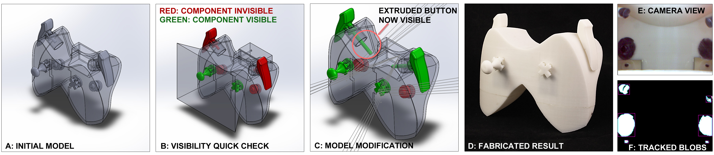
Sauron supports several kinds of inputs, which have different kinds of
motion, like buttons, dials, trackballs, and sliders.
 
You can make your own inputs if you want to code up the computer vision
algorithms for them, but you can also just modify the existing inputs
to fit your needs, like turning a dial into a volume knob or a DJ
mixing wheel:

The computer vision works in different ways depending on the way the
component moves. You can dig around and check it out, but the gist
is this:

Technical Details
=================
The Sauron model-modification tool is written as a plugin for SolidWorks.
I wrote and tested it on SW2012, but theoretically it will work in newer
versions of that tool. The computer vision subsystems are written with
OpenFrameworks, and everything in here communicates via OSC messages.

Here there be Dragons
=====================
This code was written as a part of my PhD, and thus it can be sketchy in
some places! It's not very well documented, but I wanted to provide it
on github for anyone curious about spelunking through it and hopefully
making use of it in some way.
